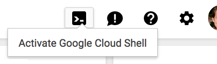
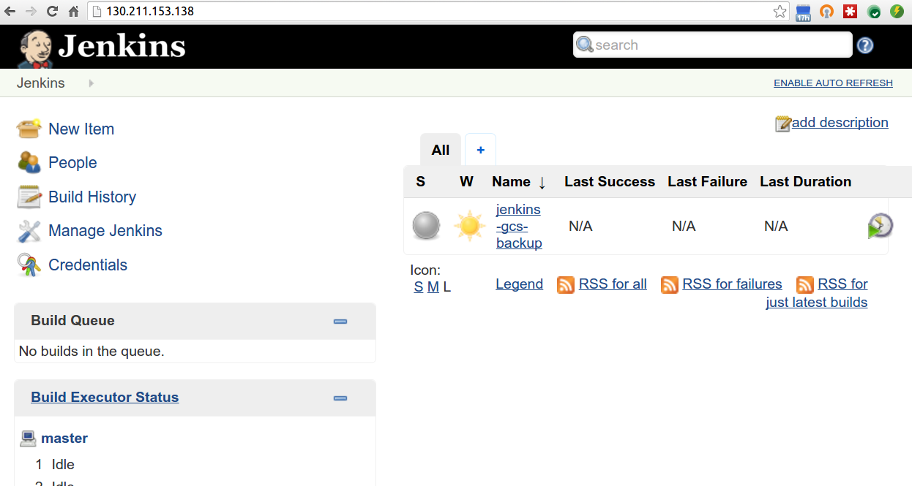

# Lab: Build a Continuous Delivery Pipeline with Jenkins and Kubernetes 

## Prerequisites
1. A Google Cloud Platform Account

## Do this first
In this section you will start your [Google Cloud Shell](https://cloud.google.com/cloud-shell/docs/) and clone the lab code repository to it.

1. Create a new Google Cloud Platform project: [https://console.developers.google.com/project](https://console.developers.google.com/project)

1. Click the Google Cloud Shell icon in the top-right and wait for your shell to open:

  

  

1. When the shell is open, set your default compute zone:

  ```shell
  $ gcloud config set compute/zone us-central1-f
  ```

1. Clone the lab repository in your cloud shell, then `cd` into that dir:

  ```shell
  $ git clone https://github.com/GoogleCloudPlatform/continuous-deployment-on-kubernetes.git
  Cloning into 'continuous-deployment-on-kubernetes'...
  ...

  $ cd continuous-deployment-on-kubernetes
  ```

##  Create a Kubernetes Cluster
You'll use Google Container Engine to create and manage your Kubernetes cluster. Provision the cluster with `gcloud`:

```shell
$ gcloud container clusters create gtc \
  --num-nodes 3 \
  --machine-type g1-small \
  --scopes "https://www.googleapis.com/auth/projecthosting,https://www.googleapis.com/auth/devstorage.full_control,https://www.googleapis.com/auth/monitoring,https://www.googleapis.com/auth/logging.write,https://www.googleapis.com/auth/compute,https://www.googleapis.com/auth/cloud-platform"
```

Now you can confirm that the cluster is running and `kubectl` is working by listing pods:

```shell
$ kubectl get pods
```

Add a quota to restrict how much of the cluster's compute and memory resources Jenkins can use:

```shell
kubectl create -f kubernetes/jenkins/quota.yaml
```

An empty response is what you expect here.

### Create a Jenkins Replication Controller and Service
Here you'll create a Replication Controller running a Jenkins image, and then a service that will route requests to the controller. 

> **Note**: All of the files that define the Kubernetes resources you will be creating for Jenkins are in the `kubernetes/jenkins` folder in the `jenkins-kube-cd` folder. You are encouraged to take a look at them before running the create commands.

The Jenkins Replication Controller is defined in `kubernetes/jenkins/jenkins.yaml`. Create the controller and confirm a pod was scheduled:

```shell
$ kubectl create -f kubernetes/jenkins/jenkins.yaml
replicationcontrollers/jenkins-leader

$ kubectl get pods
NAME                   READY     STATUS    RESTARTS   AGE
jenkins-leader-to8xg   0/1       Pending   0          30s
```

Now, deploy the Jenkins Service found in `kubernetes/jenkins/service_jenkins.yaml`:

```shell
$ kubectl create -f kubernetes/jenkins/service_jenkins.yaml
...
```

Notice that this service exposes ports `8080` and `50000` for any pods that match the `selector`. This will expose the Jenkins web UI and builder/agent registration ports within the Kubernetes cluster, but does not make them available to the public Internet. Although you could expose port `8080` to the public Internet, Kubernetes makes it simple to use nginx as a reverse proxy, providying basic authentication (and optional SSL termination). Configure that in the next section.

### Create a build agent replication controller
Now that you're running Jenkins, you'll want to run some workers that can do the build jobs assigned by Jenkins. These workers will be Kubernetes pods managed by a replication controller. The pods will be configured to have access to the Docker service on the node they're schedule on. This will allow Jenkins build jobs to be defined as Docker containers, which is super powerful and flexible.

The build agent Replication Controller is defined in `kubernetes/jenkins/build_agent.yaml`. Create the controller and confirm a pod was scheduled:

```shell
$ kubectl create -f kubernetes/jenkins/build_agent.yaml
replicationcontrollers/jenkins-builder

$ kubectl get pods
NAME                   READY     STATUS    RESTARTS   AGE
jenkins-builder-9zttr   0/1       Pending   0          23s
jenkins-leader-to8xg    1/1       Running   0          4h 
```

### Create a Nginx Replication Controller and Service
The Nginx reverse proxy will be deployed (like the Jenkins server) as a replication controller with a service. The service will have a public load balancer associated.

The nginx Replication Controller is defined in `kubernetes/jenkins/proxy.yaml`. You'll use the Kubernetes `secrets` API to create an `htpasswd` file that lets nginx enforce basic authentication. You can also enable SSL or customize the default username or password. See [Enabling SSL or Basic Access Authentication](https://cloud.google.com/solutions/automated-build-images-with-jenkins-kubernetes#enabling_ssl_or_basic_access_authentication) for detailed instructions.

Deploy the secrets and proxy to Kubernetes:

```shell
$ kubectl create -f kubernetes/jenkins/ssl_secrets.yaml
```

```shell
$ kubectl create -f kubernetes/jenkins/proxy.yaml
```

Now, deploy the proxy service found in `kubernetes/jenkins/service_proxy.yaml`. This will expose the nginx pods to the Internet:

```shell
$ kubectl create -f kubernetes/jenkins/service_proxy.yaml
...
```

<a name="connect-to-jenkins"></a>
### Connect to Jenkins

Now find the load balancer IP address of your proxy service (in the `LoadBalancer Ingress` field). **This field may take a few minutes to appear as the load balancer is being provisioned**: 

```shell
$  kubectl describe service/nginx-ssl-proxy
Name:                   nginx-ssl-proxy
Namespace:              default
Labels:                 name=nginx,role=ssl-proxy
Selector:               name=nginx,role=ssl-proxy
Type:                   LoadBalancer
IP:                     10.119.253.42
LoadBalancer Ingress:   130.211.153.138 <-- This IP right here is what you want
Port:                   https   443/TCP
NodePort:               https   30139/TCP
Endpoints:              10.116.0.9:443
Port:                   http    80/TCP
NodePort:               http    30355/TCP
Endpoints:              10.116.0.9:80
Session Affinity:       None
No events.
```

Open the load balancer's IP address in your web browser and sign in with the default Jenkins username and password(`jenkins:jenkins`).



### Your progress, and what's next
You've got a Kubernetes cluster managed by Google Container Engine. You've deployed:

* a Jenkins replication controller
* a (non-public) service that exposes Jenkins 
* a Nginx reverse-proxy replication controller that routes to the Jenkins service
* a public service that exposes Nginx

You have the tools to build a continuous delivery pipeline. Now you need a sample app to deploy continuously.

## The sample app
You'll use a very simple sample application - `gceme` - as the basis for your CD pipeline. `gceme` is written in Go and is located in the `sampleapp/gceme` directory in tihs repo. When you run the `gceme` binary on a GCE instance, it displays the instance's metadata in a pretty card:


The binary supports two modes of operation, designed to mimic a microservice. In backend mode, `gceme` will listen on a port (8080 by default) and return GCE instance metadata as JSON, with content-type=application/json. In frontend mode, `gceme` will query a backend `gceme` service and render that JSON in the UI you saw above. It looks roughly like this:

```
-----------      ------------      ~~~~~~~~~~~~        -----------
|         |      |          |      |          |        |         |
|  user   | ---> |   gceme  | ---> | lb/proxy | -----> |  gceme  |
|(browser)|      |(frontend)|      |(optional)|   |    |(backend)|
|         |      |          |      |          |   |    |         |
-----------      ------------      ~~~~~~~~~~~~   |    -----------
                                                  |    -----------
                                                  |    |         |
                                                  |--> |  gceme  |
                                                       |(backend)|
                                                       |         |
                                                       -----------
```

Both the frontend and backend modes of the application support two additional URLs:

1. `/version` prints the version of the binary (declared as a const in `main.go`)
1. `/healthz` reports the health of the application. In frontend mode, health will be OK if the backend is reachable.

## Deploy the sample app to Kubernetes
In this section you will deploy the `gceme` frontend and backend to Kubernetes using Kubernetes manifest files (included in this repo) that describe the environment that the `gceme` binary/Docker image will be deployed to. They use a default `gceme` Docker image that you will be updating with your own in a later section.

You'll have two environments - staging and production - and use Kubernetes namespaces to isolate them. 

> **Note**: The manifest files for this section of the tutorial are in `kubernetes/gceme` in the `jenkins-kube-cd` repo. You are encouraged to open and read each one before creating it per the instructions.

1. Create the namespaces:

  ```shell
  $ kubectl create -f kubernetes/gceme/namespace-staging.yaml`   

  $ kubectl create -f kubernetes/gceme/namespace-prod.yaml`
  ```

1. Create quotas for each namespace:

  ```shell
  $ kubectl create --namespace=staging kubernetes/gceme/quota.yaml

  $ kubectl create --namespace=staging kubernetes/gceme/quota.yaml
  ```

1. Create the replication controllers and services for staging:

    `$ kubectl --namespace=staging create -f kubernetes/gceme/service_frontend.yaml`

    `$ kubectl --namespace=staging create -f kubernetes/gceme/service_backend.yaml`

    `$ kubectl --namespace=staging create -f kubernetes/gceme/frontend.yaml`

    `$ kubectl --namespace=staging create -f kubernetes/gceme/backend.yaml`
    
1. Repeat step 2, but for the `production` namespace:

    `$ kubectl --namespace=production create -f kubernetes/gceme/service_frontend.yaml`

    `$ kubectl --namespace=production create -f kubernetes/gceme/service_backend.yaml`

    `$ kubectl --namespace=production create -f kubernetes/gceme/frontend.yaml`

    `$ kubectl --namespace=production create -f kubernetes/gceme/backend.yaml`

    `$ kubectl --namespace=production scale rc/gceme-frontend --replicas=4`

1. Retrieve the public IP for both services:

  ```shell
  $ kubectl --namespace=staging get service/gceme-frontend
  NAME      LABELS       SELECTOR              IP(S)           PORT(S)
  gceme     name=gceme   name=gceme-frontend   10.235.248.11   80/TCP
                                               104.197.84.5 
  ```
  
  ```shell
  $ kubectl --namespace=production get service/gceme-frontend
  NAME      LABELS       SELECTOR              IP(S)            PORT(S)
  gceme     name=gceme   name=gceme-frontend   10.235.243.23    80/TCP
                                               104.197.36.222 
  ```

1. Confirm that both services are working by opening them in your browser

1. Open a terminal and poll the staging endpoint's `/version` URL so you can easily observe rolling updates in the next section:

   ```shell
   $ while true; do curl http://YOUR_STAGING_SERVICE_IP/version; sleep 1;  done
   ```

### Create a repository for the sample app source
Here you'll create your own copy of the `gceme` sample app in GitHub.

1. Create a new GitHub repository named `gceme` and follow instructions on the GitHub website to clone the repository to your laptop

1. Copy the contents of `sampleapp/gceme` to the repo you just cloned:

    ```shell
    $ cp -R sampleapp/gceme/* ~/path/to/cloned/repo/
    ```

1. Add, commit, and push all the files:

    ```shell
    $ git add .
    $ git commit -m "Initial commit"
    $ git push origin master
    ```

## Create a pipeline
You'll now use Jenkins to define and run a pipeline that will test, build, and deploy your copy of `gceme` to your Kubernetes cluster. You'll approach this in phases. Let's get started with the first.

### Phase 1: Create a Multibranch Workflow project
This lab uses [Jenkins Workflow](https://wiki.jenkins-ci.org/display/JENKINS/Workflow+Plugin) to define builds as groovy scripts.

Navigate to your Jenkins UI and follow these steps to configure a Multibranch Workflow project (hot tip: you can find the IP address of your Jenkins install with `kubectl get service/nginx-ssl-proxy`):

1. Click the **New Item** link in the left nav

1. Name the project **gceme**, choose the **Multibranch Workflow** option, then click `OK`

1. Click `Add Source` and choose `git`

  1. Paste the **HTTPS clone URL** of your `gceme` repo on GitHub into the **Project Repository** field. You can find this value on your GitHub page in the right column:
  
     

1. Click `Save`, leaving all other options with their defaults

### Phase 2: Create a Jenkinsfile to pass the build
Make the build pass by adding a simple valid `Jenkinsfile` script to your `gceme` repo. The file should be in your repo's root and have the following contents:

```groovy
node('docker') {
  sh "echo success"
}
```

The `Jenkinsfile` is written using the Jenkins Workflow DSL (Groov-based). It allows an entire build pipeline to be expressed in a single script, and supports powerful features like parallelization, stages, and user input. 

`git add Jenkinsfile`, then `git commit`, and finally `git push origin master` to push your changes to GitHub.

Navigate to your **gceme** project in Jenkins, click **Branch Indexing** in the left column, then choose **Index Now**. This will cause Jenkins to detect the Jenkinsfile in your master branch and recognize that branch as buildable.

When indexing completes, go back to the **gceme** project in Jenkins and click the build button in the **master** branch row (the icon is a clock with a green triangle). After a few moments the build should complete successfully. You may need the refresh the page to see the result:


### Phase 3: Modify Jenkinsfile to bulid and test the app
Modify your `Jenkinsfile` script so it contains the following complete script (or copy the file from `misc/Jenkinsfile` in the `jenkins-cube-cd` repo).

**Be sure to replace _REPLACE_WITH_YOUR_PROJECT_NAME_ on line 7 with your project name:**

```groovy
node('docker') {
  checkout scm

  // Kubernetes cluster info
  def cluster = 'gtc'
  def zone = 'us-central1-f'
  def project = 'REPLACE_WITH_YOUR_PROJECT_NAME'

  // Run tests
  stage 'Go tests'
  docker.image('golang:1.5.1').inside {
    sh('go get -d -v')
    sh('go test')
  }

  // Build image with Go binary
  stage 'Build Docker image'
  def img = docker.build("gcr.io/${project}/gceme:${env.BUILD_TAG}")
  sh('gcloud docker -a')
  img.push()

  // Deploy image to cluster in dev namespace
  stage 'Deploy to QA cluster'
  docker.image('buildpack-deps:jessie-scm').inside {
    sh('apt-get update -y ; apt-get install jq')
    sh('export CLOUDSDK_CORE_DISABLE_PROMPTS=1 ; curl https://sdk.cloud.google.com | bash')
    sh("/root/google-cloud-sdk/bin/gcloud container clusters get-credentials ${cluster} --zone ${zone}")
    sh('curl -o /usr/bin/kubectl https://storage.googleapis.com/kubernetes-release/release/v1.0.1/bin/linux/amd64/kubectl ; chmod +x /usr/bin/kubectl')
    sh("kubectl --namespace=staging rollingupdate gceme-frontend --image=${img.id} --update-period=5s")
    sh("kubectl --namespace=staging rollingupdate gceme-backend --image=${img.id} --update-period=5s")
    sh("echo http://`kubectl --namespace=staging get service/gceme-frontend --output=json | jq -r '.status.loadBalancer.ingress[0].ip'` > staging")
  }

  // Deploy to prod if approved
  stage 'Approve, deploy to prod'
  def url = readFile('staging').trim()
  input message: "Does staging at $url look good? ", ok: "Deploy to production"
  sh('gcloud docker -a')
  img.push('latest')
  docker.image('buildpack-deps:jessie-scm').inside {
    sh('apt-get update -y ; apt-get install jq')
    sh('export CLOUDSDK_CORE_DISABLE_PROMPTS=1 ; curl https://sdk.cloud.google.com | bash')
    sh("/root/google-cloud-sdk/bin/gcloud container clusters get-credentials ${cluster} --zone ${zone}")
    sh('curl -o /usr/bin/kubectl https://storage.googleapis.com/kubernetes-release/release/v1.0.1/bin/linux/amd64/kubectl ; chmod +x /usr/bin/kubectl')
    sh("kubectl --namespace=production rollingupdate gceme-frontend --image=${img.id} --update-period=5s")
    sh("kubectl --namespace=production rollingupdate gceme-backend --image=${img.id} --update-period=5s")
    sh("echo http://`kubectl --namespace=production get service/gceme-frontend --output=json | jq -r '.status.loadBalancer.ingress[0].ip'`")
  }
}
```

Don't commit the new `Jenkinsfile` just yet. You'll make one more change in the next section, then commit and push them together.

## Deploy a change
Now that your pipeline is working, it's time to make a change to the `gceme` app and let your pipeline test, package, and deploy it.

1. In the `gceme` repository on your workstation open `html.go` and replace the word `blue` with `orange` (there should be exactly two occurrences):

  ```css
  //snip
  <div class="card orange">
  <div class="card-content white-text">
  <div class="card-title">Backend that serviced this request</div>
  //snip
  ```

1. In the same repository, open `main.go` and change the version number from `1.0.0` to `2.0.0`:

   ```go
   //snip
   const version string = "4.0.0"
   //snip
   ```

1. `git add Jenkinsfile html.go main.go`, then `git commit`, and finally `git push origin master` your change. When the change has pushed,

1. When your change has been pushed to GitHub, navigate to Jenkins and click the button to run your build.

1. Once the build is running, click the down arrow next to the build in the left column and choose **Console Output**:

  

1. Track the output for a few minutes and watch for the `kubectl rollingupdate...` to begin. When it starts, open the terminal that's polling staging's `/version` URL and observe it start to change.

1. When the change is deployed to staging and you are prompted to deploy it:

  

1. If everything looks good, click the **Deploy to production** link. Confirm that production looks good when it completes.

1. Look at the `Jenkinsfile` in the project and analyze how the approval workflow is written.

## Extra credit: deploy a breaking change, then roll back
Make a breaking change to the `gceme` source, push it, and deploy it through the pipeline to production. Then pretend latency spiked after the deployment and you want to roll back. Do it! Faster!

Things to consider:

* What is the Docker image you want to deploy for roll back?
* How can you interact directly with the Kubernetes to trigger the deployment?
* Is SRE really what you want to do with your life?

## Clean up
Clean up is really easy, but also super important: if you don't follow these instructions, you will continue to be billed for the Google Container Engine cluster you created.

To clean up, navigate to the [Google Developers Console Project List](https://console.developers.google.com/project), choose the project you created for this lab, and delete it. That's it.

