# Lab: Build a Continuous Deployment Pipeline with Jenkins and Kubernetes

For a more in depth best practices guide, go to the solution posted [here](https://cloud.google.com/solutions/jenkins-on-container-engine).

## Introduction

This guide will take you through the steps necessary to continuously deliver
your software to end users by leveraging [Google Container Engine](https://cloud.google.com/container-engine/)
and [Jenkins](https://jenkins.io) to orchestrate the software delivery pipeline.
If you are not familiar with basic Kubernetes concepts, have a look at
[Kubernetes 101](http://kubernetes.io/docs/user-guide/walkthrough/).

In order to accomplish this goal you will use the following Jenkins plugins:
  - [Jenkins Kubernetes Plugin](https://wiki.jenkins-ci.org/display/JENKINS/Kubernetes+Plugin) - start Jenkins build executor containers in the Kubernetes cluster when builds are requested, terminate those containers when builds complete, freeing resources up for the rest of the cluster
  - [Jenkins Pipelines](https://jenkins.io/solutions/pipeline/) - define our build pipeline declaratively and keep it checked into source code management alongside our application code
  - [Google Oauth Plugin](https://wiki.jenkins-ci.org/display/JENKINS/Google+OAuth+Plugin) - allows you to add your google oauth credentials to jenkins

In order to deploy the application with [Kubernetes](http://kubernetes.io/) you will use the following resources:
  - [Deployments](http://kubernetes.io/docs/user-guide/deployments/) - replicates our application across our kubernetes nodes and allows us to do a controlled rolling update of our software across the fleet of application instances
  - [Services](http://kubernetes.io/docs/user-guide/services/) - load balancing and service discovery for our internal services
  - [Ingress](http://kubernetes.io/docs/user-guide/ingress/) - external load balancing and SSL termination for our external service
  - [Secrets](http://kubernetes.io/docs/user-guide/secrets/) - secure storage of non public configuration information, SSL certs specifically in our case

## Prerequisites

1. A Google Cloud Platform Account
1. [Enable the Compute Engine, Container Engine, and Container Builder APIs](https://console.cloud.google.com/flows/enableapi?apiid=compute_component,container,cloudbuild.googleapis.com)

## Do this first

In this section you will start your [Google Cloud Shell](https://cloud.google.com/cloud-shell/docs/)
and clone the lab code repository to it.

1. Create a new Google Cloud Platform project: [https://console.developers.google.com/project](https://console.developers.google.com/project)

1. Click the Activate Cloud Shell icon in the top-right and wait for your shell to open.

   

   > If you are prompted with a _Learn more_ message, click __Continue__ to
   > finish opening the Cloud Shell.

1. When the shell is open, use the [gcloud](https://cloud.google.com/sdk/)
   command line interface tool to set your default compute zone:

   

   ```shell
   gcloud config set compute/zone us-east1-d
   ```

   Output (do not copy):

   ```output
   Updated property [compute/zone].
   ```

1. Set an environment variable with your project:

   ```shell
   export GOOGLE_CLOUD_PROJECT=$(gcloud config get-value project)
   ```

   Output (do not copy):

   ```output
   Your active configuration is: [cloudshell-...]
   ```

1. Clone the lab repository in your cloud shell, then `cd` into that dir:

   ```shell
   git clone https://github.com/GoogleCloudPlatform/continuous-deployment-on-kubernetes.git
   ```

   Output (do not copy):

   ```output
   Cloning into 'continuous-deployment-on-kubernetes'...
   ...
   ```

   ```shell
   cd continuous-deployment-on-kubernetes
   ```

## Create a Service Account with permissions

1. Create a service account, on Google Cloud Platform (GCP).

   Create a new service account because it's the recommended way to avoid
   using extra permissions in Jenkins and the cluster.

   ```shell
   gcloud iam service-accounts create jenkins-sa \
       --display-name "jenkins-sa"
   ```

   Output (do not copy):

   ```output
   Created service account [jenkins-sa].
   ```

1. Add required permissions, to the service account, using predefined roles.

   Most of these permissions are related to Jenkins use of _Cloud Build_, and
   storing/retrieving build artifacts in _Cloud Storage_. Also, the
   service account needs to enable the Jenkins agent to read from a repo
   you will create in _Cloud Source Repositories (CSR)_.

   ```shell
   gcloud projects add-iam-policy-binding $GOOGLE_CLOUD_PROJECT \
       --member "serviceAccount:jenkins-sa@$GOOGLE_CLOUD_PROJECT.iam.gserviceaccount.com" \
       --role "roles/viewer"

   gcloud projects add-iam-policy-binding $GOOGLE_CLOUD_PROJECT \
       --member "serviceAccount:jenkins-sa@$GOOGLE_CLOUD_PROJECT.iam.gserviceaccount.com" \
       --role "roles/source.reader"

   gcloud projects add-iam-policy-binding $GOOGLE_CLOUD_PROJECT \
       --member "serviceAccount:jenkins-sa@$GOOGLE_CLOUD_PROJECT.iam.gserviceaccount.com" \
       --role "roles/storage.admin"

   gcloud projects add-iam-policy-binding $GOOGLE_CLOUD_PROJECT \
       --member "serviceAccount:jenkins-sa@$GOOGLE_CLOUD_PROJECT.iam.gserviceaccount.com" \
       --role "roles/storage.objectAdmin"

   gcloud projects add-iam-policy-binding $GOOGLE_CLOUD_PROJECT \
       --member "serviceAccount:jenkins-sa@$GOOGLE_CLOUD_PROJECT.iam.gserviceaccount.com" \
       --role "roles/cloudbuild.builds.editor"

   gcloud projects add-iam-policy-binding $GOOGLE_CLOUD_PROJECT \
       --member "serviceAccount:jenkins-sa@$GOOGLE_CLOUD_PROJECT.iam.gserviceaccount.com" \
       --role "roles/container.developer"
   ```

   You can check the permissions added using __IAM & admin__ in Cloud Console.

   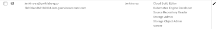

1. Export the service account credentials to a JSON key file in Cloud Shell:

   ```shell
   gcloud iam service-accounts keys create ~/jenkins-sa-key.json \
       --iam-account "jenkins-sa@$GOOGLE_CLOUD_PROJECT.iam.gserviceaccount.com"
   ```

   Output (do not copy):

   ```output
   created key [...] of type [json] as [/home/.../jenkins-sa-key.json] for [jenkins-sa@myproject.aiam.gserviceaccount.com]
   ```

1. Download the JSON key file to your local machine.

   Click __Download File__ from __More__ on the Cloud Shell toolbar:

   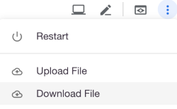

1. Enter the __File path__ as `jenkins-sa-key.json` and click __Download__.

   The file will be downloaded to your local machine, for use later.

## Create a Kubernetes Cluster

1. Provision the cluster with `gcloud`:

   Use Google Kubernetes Engine (GKE) to create and manage your Kubernetes
   cluster, named `jenkins-cd`. Use the _service account_ created earlier.

   ```shell
   gcloud container clusters create jenkins-cd \
     --num-nodes 2 \
     --machine-type n1-standard-2 \
     --cluster-version 1.15 \
     --service-account "jenkins-sa@$GOOGLE_CLOUD_PROJECT.iam.gserviceaccount.com"
   ```

   Output (do not copy):

   ```output
   NAME        LOCATION    MASTER_VERSION  MASTER_IP     MACHINE_TYPE  NODE_VERSION   NUM_NODES  STATUS
   jenkins-cd  us-east1-d  1.15.11-gke.15   35.229.29.69  n1-standard-2 1.15.11-gke.15  2          RUNNING
   ```

1. Once that operation completes, retrieve the credentials for your cluster.

   ```shell
   gcloud container clusters get-credentials jenkins-cd
   ```

   Output (do not copy):

   ```output
   Fetching cluster endpoint and auth data.
   kubeconfig entry generated for jenkins-cd.
   ```

1. Confirm that the cluster is running and `kubectl` is working by listing pods:

   ```shell
   kubectl get pods
   ```

   Output (do not copy):

   ```output
   No resources found.
   ```

   > You would see an error if the cluster was not created, or you did not
   > have permissions.

1. Add yourself as a cluster administrator in the cluster's RBAC so that you can
   give Jenkins permissions in the cluster:

    ```shell
    kubectl create clusterrolebinding cluster-admin-binding --clusterrole=cluster-admin --user=$(gcloud config get-value account)
    ```

    Output (do not copy):

    ```output
    Your active configuration is: [cloudshell-...]
    clusterrolebinding.rbac.authorization.k8s.io/cluster-admin-binding created
    ```

## Install Helm

In this lab, you will use Helm to install Jenkins with a stable _chart_.  Helm
is a package manager that makes it easy to configure and deploy Kubernetes
applications.  Once you have Jenkins installed, you'll be able to set up your
CI/CD pipleline.

1. Download and install the helm binary

    ```shell
    wget https://get.helm.sh/helm-v3.2.1-linux-amd64.tar.gz
    ```

1. Unzip the file to your local system:

    ```shell
    tar zxfv helm-v3.2.1-linux-amd64.tar.gz
    cp linux-amd64/helm .
    ```

1. Add the official stable repository.

    ```shell
    ./helm repo add stable https://kubernetes-charts.storage.googleapis.com
    ```

1. Ensure Helm is properly installed by running the following command. You
   should see version `v3.2.1` appear:

    ```shell
    ./helm version
    ```

    Output (do not copy):

    ```output
    version.BuildInfo{Version:"v3.2.1", GitCommit:"fe51cd1e31e6a202cba7dead9552a6d418ded79a", GitTreeState:"clean", GoVersion:"go1.13.10"}
    ```

## Configure and Install Jenkins

You will use a custom [values file](https://github.com/helm/charts/blob/master/stable/jenkins/values.yaml)
to add the GCP specific plugin necessary to use service account credentials to reach your Cloud Source Repository.

1. Use the Helm CLI to deploy the chart with your configuration set.

    ```shell
    ./helm install cd-jenkins -f jenkins/values.yaml stable/jenkins --version 1.7.3 --wait
    ```

    Output (do not copy):

    ```output
    ...
    For more information on running Jenkins on Kubernetes, visit:
    https://cloud.google.com/solutions/jenkins-on-container-engine
    ```

1. The Jenkins pod __STATUS__ should change to `Running` when it's ready:

    ```shell
    kubectl get pods
    ```

    Output (do not copy):

    ```output
    NAME                          READY     STATUS    RESTARTS   AGE
    cd-jenkins-7c786475dd-vbhg4   1/1       Running   0          1m
    ```

1. Configure the Jenkins service account to be able to deploy to the cluster.

    ```shell
    kubectl create clusterrolebinding jenkins-deploy --clusterrole=cluster-admin --serviceaccount=default:cd-jenkins
    ```

    Output (do not copy):

    ```output
    clusterrolebinding.rbac.authorization.k8s.io/jenkins-deploy created
    ```

1. Set up port forwarding to the Jenkins UI, from Cloud Shell:

    ```shell
    export JENKINS_POD_NAME=$(kubectl get pods -l "app.kubernetes.io/component=jenkins-master" -o jsonpath="{.items[0].metadata.name}")
    kubectl port-forward $JENKINS_POD_NAME 8080:8080 >> /dev/null &
    ```

1. Now, check that the Jenkins Service was created properly:

    ```shell
    kubectl get svc
    ```

    Output (do not copy):

    ```output
    NAME               CLUSTER-IP     EXTERNAL-IP   PORT(S)     AGE
    cd-jenkins         10.35.249.67   <none>        8080/TCP    3h
    cd-jenkins-agent   10.35.248.1    <none>        50000/TCP   3h
    kubernetes         10.35.240.1    <none>        443/TCP     9h
    ```

    This Jenkins configuration is using the [Kubernetes Plugin](https://wiki.jenkins-ci.org/display/JENKINS/Kubernetes+Plugin),
    so that builder nodes will be automatically launched as necessary when the
    Jenkins master requests them.  Upon completion of the work, the builder nodes
    will be automatically turned down, and their resources added back to the
    cluster's resource pool.

    Notice that this service exposes ports `8080` and `50000` for any pods that
    match the `selector`. This will expose the Jenkins web UI and builder/agent
    registration ports within the Kubernetes cluster.  Additionally the `jenkins-ui`
    services is exposed using a ClusterIP so that it is not accessible from outside
    the cluster.

## Connect to Jenkins

1. The Jenkins chart will automatically create an admin password for you. To
   retrieve it, run:

    ```shell
    printf $(kubectl get secret cd-jenkins -o jsonpath="{.data.jenkins-admin-password}" | base64 --decode);echo
    ```

2. To get to the Jenkins user interface, click on the Web Preview
   button in cloud shell, then click
   **Preview on port 8080**:

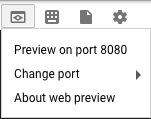

You should now be able to log in with username `admin` and your auto generated
password.

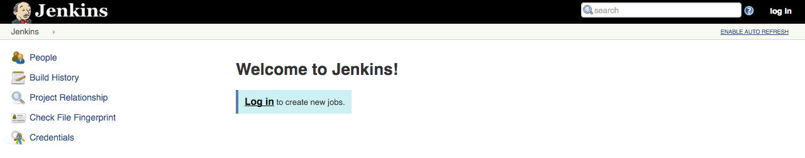

### Your progress, and what's next

You've got a Kubernetes cluster managed by GKE. You've deployed:

* a Jenkins Deployment
* a (non-public) service that exposes Jenkins to its agent containers

You have the tools to build a continuous deployment pipeline. Now you need a
sample app to deploy continuously.

## The sample app

You'll use a very simple sample application - `gceme` - as the basis for your CD
pipeline. `gceme` is written in Go and is located in the `sample-app` directory
in this repo. When you run the `gceme` binary on a GCE instance, it displays the
instance's metadata in a pretty card:

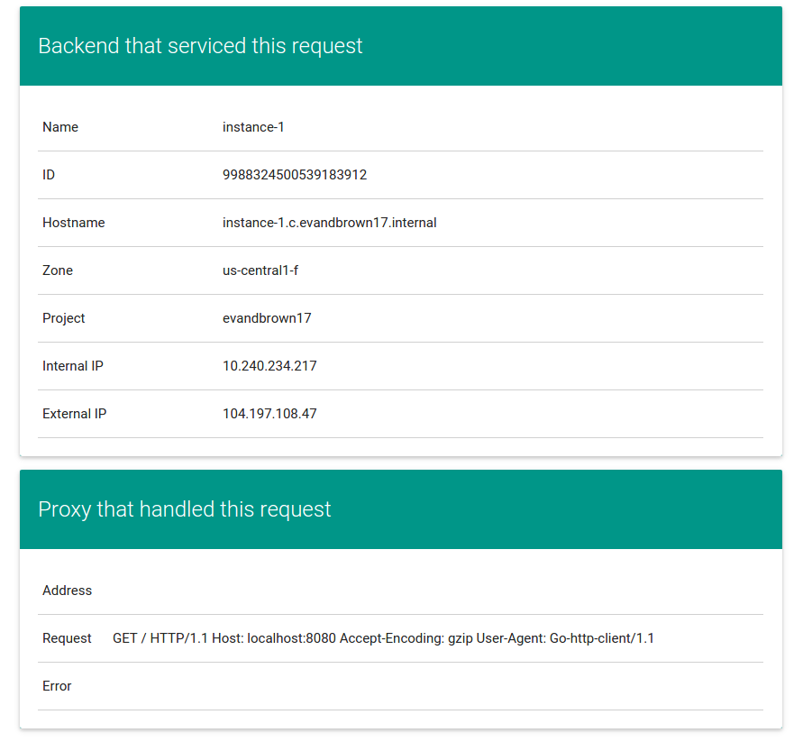

The binary supports two modes of operation, designed to mimic a microservice. In
backend mode, `gceme` will listen on a port (8080 by default) and return GCE
instance metadata as JSON, with content-type=application/json. In frontend mode,
`gceme` will query a backend `gceme` service and render that JSON in the UI you
saw above. It looks roughly like this:

```
-----------      ------------      ~~~~~~~~~~~~        -----------
|         |      |          |      |          |        |         |
|  user   | ---> |   gceme  | ---> | lb/proxy | -----> |  gceme  |
|(browser)|      |(frontend)|      |(optional)|   |    |(backend)|
|         |      |          |      |          |   |    |         |
-----------      ------------      ~~~~~~~~~~~~   |    -----------
                                                  |    -----------
                                                  |    |         |
                                                  |--> |  gceme  |
                                                       |(backend)|
                                                       |         |
                                                       -----------
```
Both the frontend and backend modes of the application support two additional URLs:

1. `/version` prints the version of the binary (declared as a const in
   `main.go`)
1. `/healthz` reports the health of the application. In frontend mode, health
   will be OK if the backend is reachable.

### Deploy the sample app to Kubernetes

In this section you will deploy the `gceme` frontend and backend to Kubernetes
using Kubernetes manifest files (included in this repo) that describe the
environment that the `gceme` binary/Docker image will be deployed to. They use a
default `gceme` Docker image that you will be updating with your own in a later
section.

You'll have two primary environments -
[canary](http://martinfowler.com/bliki/CanaryRelease.html) and production - and
use Kubernetes to manage them.

> **Note**: The manifest files for this section of the tutorial are in
> `sample-app/k8s`. You are encouraged to open and read each one before creating
> it per the instructions.

1. First change directories to the sample-app, back in __Cloud Shell__:

   ```shell
   cd sample-app
   ```

1. Create the namespace for production:

   ```shell
   kubectl create ns production
   ```

   Output (do not copy):

   ```output
   namespace/production created
   ```

1. Create the production Deployments for frontend and backend:

    ```shell
    kubectl --namespace=production apply -f k8s/production
    ```

    Output (do not copy):

    ```output
    deployment.extensions/gceme-backend-production created
    deployment.extensions/gceme-frontend-production created
    ```

1. Create the canary Deployments for frontend and backend:

    ```shell
    kubectl --namespace=production apply -f k8s/canary
    ```

    Output (do not copy):

    ```output
    deployment.extensions/gceme-backend-canary created
    deployment.extensions/gceme-frontend-canary created
    ```

1. Create the Services for frontend and backend:

    ```shell
    kubectl --namespace=production apply -f k8s/services
    ```

    Output (do not copy):

    ```output
    service/gceme-backend created
    service/gceme-frontend created
    ```

1. Scale the production, frontend service:

    ```shell
    kubectl --namespace=production scale deployment gceme-frontend-production --replicas=4
    ```

    Output (do not copy):

    ```output
    deployment.extensions/gceme-frontend-production scaled
    ```

1. Retrieve the External IP for the production services:

   **This field may take a few minutes to appear as the load balancer is being
   provisioned**

   ```shell
   kubectl --namespace=production get service gceme-frontend
   ```

   Output (do not copy):

   ```output
   NAME             TYPE           CLUSTER-IP     EXTERNAL-IP    PORT(S)        AGE
   gceme-frontend   LoadBalancer   10.35.254.91   35.196.48.78   80:31088/TCP   1m
   ```

1. Confirm that both services are working by opening the frontend `EXTERNAL-IP`
   in your browser

   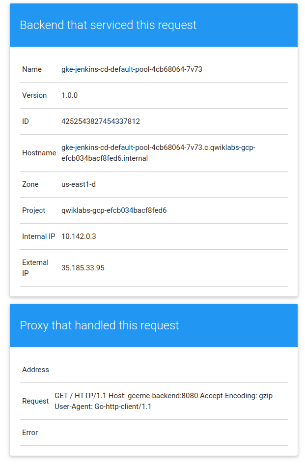

1. Poll the production endpoint's `/version` URL.

   Open a new **Cloud Shell** terminal by clicking the `+` button to the right
   of the current terminal's tab.

   ```shell
   export FRONTEND_SERVICE_IP=$(kubectl get -o jsonpath="{.status.loadBalancer.ingress[0].ip}"  --namespace=production services gceme-frontend)
   while true; do curl http://$FRONTEND_SERVICE_IP/version; sleep 3;  done
   ```

   Output (do not copy):

   ```output
   1.0.0
   1.0.0
   1.0.0
   ```

   You should see that all requests are serviced by v1.0.0 of the application.

   Leave this running in the second terminal so you can easily observe rolling
   updates in the next section.

1. Return to the first terminal/tab in Cloud Shell.

### Create a repository for the sample app source

Here you'll create your own copy of the `gceme` sample app in
[Cloud Source Repository](https://cloud.google.com/source-repositories/docs/).

1. Initialize the git repository.

   Make sure to work from the `sample-app` directory of the repo you cloned previously.

    ```shell
    git init
    git config credential.helper gcloud.sh
    gcloud source repos create gceme
    ```

1. Add a _git remote_ for the new repo in Cloud Source Repositories.

    ```shell
    git remote add origin https://source.developers.google.com/p/$GOOGLE_CLOUD_PROJECT/r/gceme
    ```

1. Ensure git is able to identify you:

    ```shell
    git config --global user.email "YOUR-EMAIL-ADDRESS"
    git config --global user.name "YOUR-NAME"
    ```

1. Add, commit, and push all the files:

   ```shell
   git add .
   git commit -m "Initial commit"
   git push origin master
   ```

   Output (do not copy):

   ```output
   To https://source.developers.google.com/p/myproject/r/gceme
    * [new branch]      master -> master
   ```

## Create a pipeline

You'll now use __Jenkins__ to define and run a pipeline that will test, build,
and deploy your copy of `gceme` to your Kubernetes cluster. You'll approach this
in phases. Let's get started with the first.

### Phase 1: Add your service account credentials

First, you will need to configure GCP credentials in order for Jenkins to be
able to access the code repository:

1. In the **Jenkins UI**, Click **Credentials** on the left
1. Click the **(global)** link
1. Click **Add Credentials** on the left
1. From the **Kind** dropdown, select `Google Service Account from private key`
1. Enter the **Project Name** from your project
1. Leave **JSON key** selected, and click **Choose File**.
1. Select the `jenkins-sa-key.json` file downloaded earlier, then click
   **Open**.

   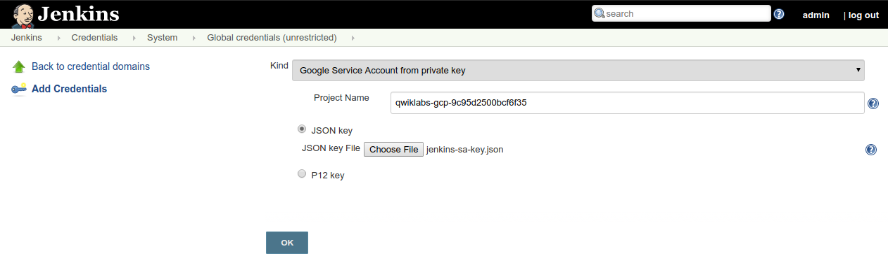

1. Click **OK**

You should now see 1 global credential. Make a note of the name of the
credential, as you will reference this in Phase 2.

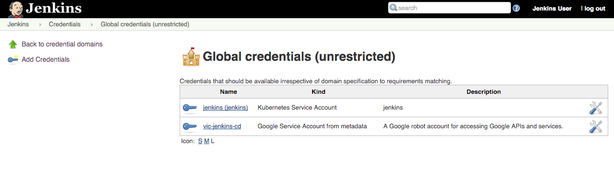

### Phase 2: Create a job

This lab uses [Jenkins Pipeline](https://jenkins.io/solutions/pipeline/) to
define builds as _groovy_ scripts.

Navigate to your Jenkins UI and follow these steps to configure a Pipeline job
(hot tip: you can find the IP address of your Jenkins install with `kubectl get
ingress --namespace jenkins`):

1. Click the **Jenkins** link in the top left toolbar, of the ui

1. Click the **New Item** link in the left nav

1. For **item name** use `sample-app`, choose the **Multibranch Pipeline**
   option, then click **OK**

   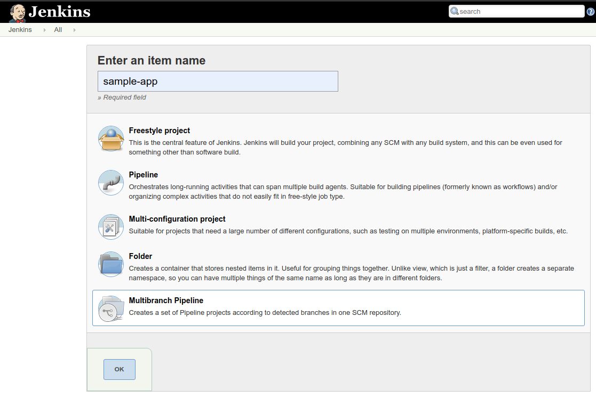

1. Click **Add source** and choose **git**

1. Paste the **HTTPS clone URL** of your `gceme` repo on Cloud Source
   Repositories into the **Project Repository** field.
   It will look like:
   https://source.developers.google.com/p/[REPLACE_WITH_YOUR_PROJECT_ID]/r/gceme

1. From the **Credentials** dropdown, select the name of the credential from
   Phase 1. It should have the format `PROJECT_ID service account`.

1. Under **Scan Multibranch Pipeline Triggers** section, check the
   **Periodically if not otherwise run** box, then set the **Interval** value to
   `1 minute`.

   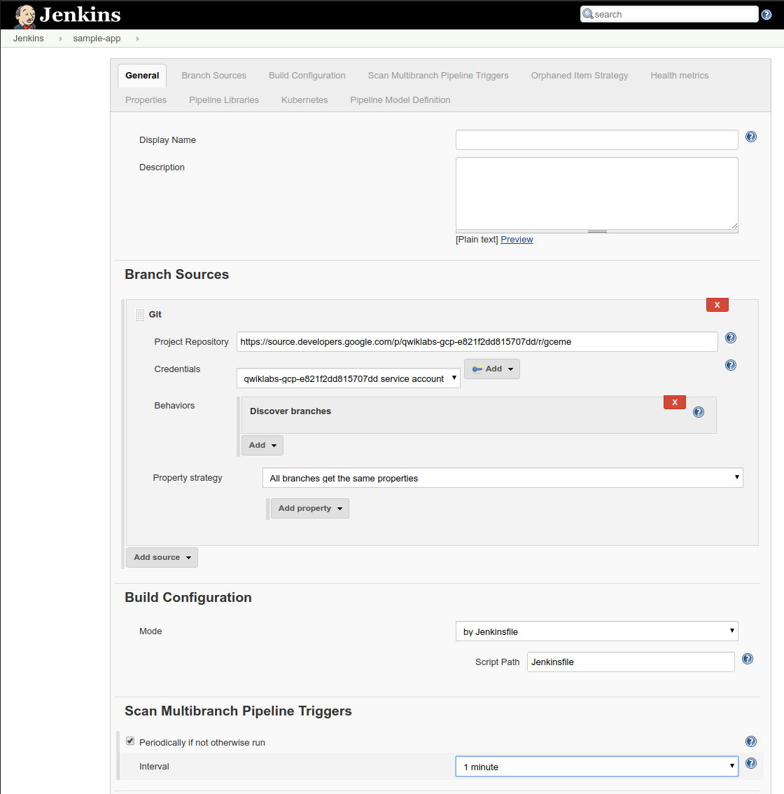

1. Click **Save**, leaving all other options with default values.

   A _Branch indexing_ job was kicked off to identify any branches in your
   repository.

1. Click **Jenkins** > **sample-app**, in the top menu.

   You should see the `master` branch now has a job created for it.

   The first run of the job will fail, until the _project name_ is set properly
   in the `Jenkinsfile` next step.

  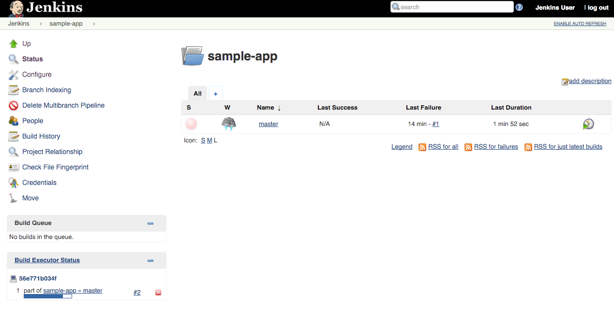

### Phase 3:  Modify Jenkinsfile, then build and test the app

1. Create a branch for the canary environment called `canary`

   ```shell
   git checkout -b canary
   ```

   Output (do not copy):

   ```output
   Switched to a new branch 'canary'
   ```

   The [`Jenkinsfile`](https://jenkins.io/doc/book/pipeline/jenkinsfile/) is
   written using the Jenkins Workflow DSL, which is Groovy-based. It allows an
   entire build pipeline to be expressed in a single script that lives alongside
   your source code and supports powerful features like parallelization, stages,
   and user input.

1. Update your `Jenkinsfile` script with the correct **PROJECT** environment value.

   **Be sure to replace `REPLACE_WITH_YOUR_PROJECT_ID` with your project name.**

   Save your changes, but don't commit the new `Jenkinsfile` change just yet.
   You'll make one more change in the next section, then commit and push them
   together.

### Phase 4: Deploy a [canary release](http://martinfowler.com/bliki/CanaryRelease.html) to canary

Now that your pipeline is working, it's time to make a change to the `gceme` app
and let your pipeline test, package, and deploy it.

The canary environment is rolled out as a percentage of the pods behind the
production load balancer.  In this case we have 1 out of 5 of our frontends
running the canary code and the other 4 running the production code. This allows
you to ensure that the canary code is not negatively affecting users before
rolling out to your full fleet.  You can use the
[labels](http://kubernetes.io/docs/user-guide/labels/) `env: production` and
`env: canary` in Google Cloud Monitoring in order to monitor the performance of
each version individually.

1. In the `sample-app` repository on your workstation open `html.go` and replace
   the word `blue` with `orange` (there should be exactly two occurrences):

  ```html
  //snip
  <div class="card orange">
  <div class="card-content white-text">
  <div class="card-title">Backend that serviced this request</div>
  //snip
  ```

1. In the same repository, open `main.go` and change the version number from
   `1.0.0` to `2.0.0`:

   ```go
   //snip
   const version string = "2.0.0"
   //snip
   ```

1. Push the _version 2_ changes to the repo:

   ```shell
   git add Jenkinsfile html.go main.go
   ```

   ```shell
   git commit -m "Version 2"
   ```

   ```shell
   git push origin canary
   ```

1. Revisit your sample-app in the Jenkins UI.

   Navigate back to your Jenkins `sample-app` job. Notice a canary pipeline
   job has been created.

   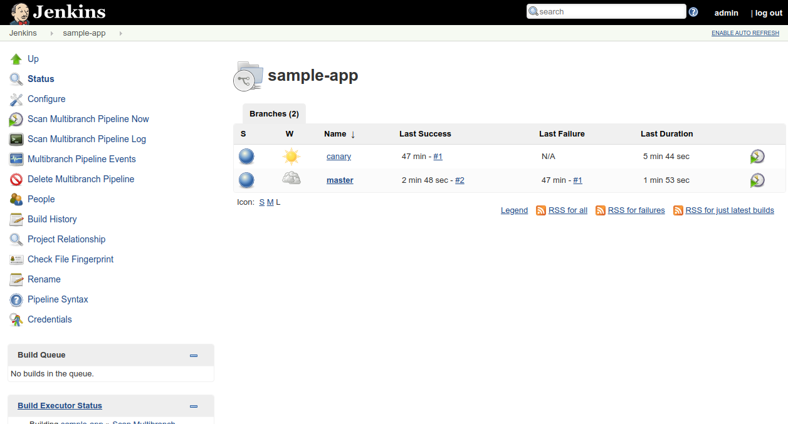

1. Follow the canary build output.

   * Click the **Canary** link.
   * Click the **#1** link the **Build History** box, on the lower left.
   * Click **Console Output** from the left-side menu.
   * Scroll down to follow.

1. Track the output for a few minutes.

   When you see `Finished: SUCCESS`, open the Cloud Shell terminal that you
   left polling `/version` of _canary_. Observe that some requests are now
   handled by the _canary_ `2.0.0` version.

   ```
   1.0.0
   1.0.0
   1.0.0
   1.0.0
   2.0.0
   2.0.0
   1.0.0
   1.0.0
   1.0.0
   1.0.0
   ```

   You have now rolled out that change, version 2.0.0, to a **subset** of users.

1. Continue the rollout, to the rest of your users.

   Back in the other Cloud Shell terminal, create a branch called
   `production`, then push it to the Git server.

   ```shell
    git checkout master
    git merge canary
    git push origin master
   ```

1. Watch the pipelines in the Jenkins UI handle the change.

   Within a minute or so, you should see a new job in the **Build Queue** and **Build Executor**.

    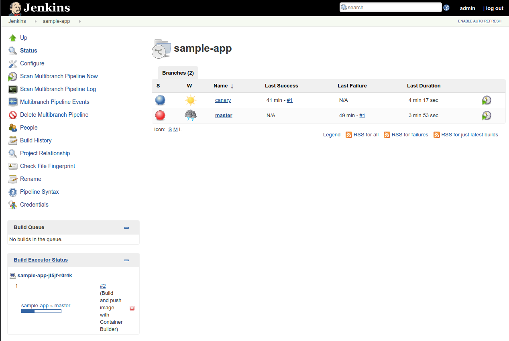

1. Clicking on the `master` link will show you the stages of your pipeline as
   well as pass/fail and timing characteristics.

   You can see the failed master job #1, and the successful master job #2.

   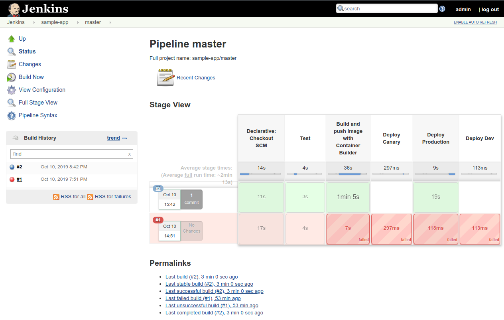

1. Check the Cloud Shell terminal responses again.

   In Cloud Shell, open the terminal polling canary's `/version` URL and observe
   that the new version, `2.0.0`, has been rolled out and is serving all
   requests.

   ```
   2.0.0
   2.0.0
   2.0.0
   2.0.0
   2.0.0
   2.0.0
   2.0.0
   2.0.0
   2.0.0
   2.0.0
   ```

If you want to understand the pipeline stages in greater detail, you can
look through the `Jenkinsfile` in the `sample-app` project directory.

### Phase 5: Deploy a development branch

Oftentimes changes will not be so trivial that they can be pushed directly to
the **canary** environment. In order to create a **development** environment,
from a long lived feature branch, all you need to do is push it up to the Git
server. Jenkins will automatically deploy your **development** environment.

In this case you will not use a loadbalancer, so you'll have to access your
application using `kubectl proxy`. This proxy authenticates itself with the
Kubernetes API and proxies requests from your local machine to the service in
the cluster without exposing your service to the internet.

#### Deploy the development branch

1. Create another branch and push it up to the Git server

   ```shell
   git checkout -b new-feature
   git push origin new-feature
   ```

1. Open Jenkins in your web browser and navigate back to sample-app.

   You should see that a new job called `new-feature` has been created,
   and this job is creating your new environment.

   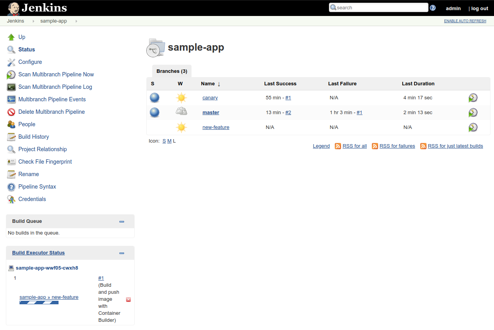

1. Navigate to the console output of the first build of this new job by:

   * Click the **new-feature** link in the job list.
   * Click the **#1** link in the Build History list on the left of the page.
   * Finally click the **Console Output** link in the left menu.

1. Scroll to the bottom of the console output of the job to see
   instructions for accessing your environment:

   ```
   Successfully verified extensions/v1beta1/Deployment: gceme-frontend-dev
   AvailableReplicas = 1, MinimumReplicas = 1

   [Pipeline] echo
   To access your environment run `kubectl proxy`
   [Pipeline] echo
   Then access your service via
   http://localhost:8001/api/v1/proxy/namespaces/new-feature/services/gceme-frontend:80/
   [Pipeline] }
   ```

#### Access the development branch

1. Set up port forwarding to the dev frontend, from Cloud Shell:

   ```shell
   export DEV_POD_NAME=$(kubectl get pods -n new-feature -l "app=gceme,env=dev,role=frontend" -o jsonpath="{.items[0].metadata.name}")
   kubectl port-forward -n new-feature $DEV_POD_NAME 8001:80 >> /dev/null &
   ```

1. Access your application via localhost:

   ```shell
   curl http://localhost:8001/api/v1/proxy/namespaces/new-feature/services/gceme-frontend:80/
   ```

   Output (do not copy):

   ```output
   <!doctype html>
   <html>
   ...
   </div>
   <div class="col s2">&nbsp;</div>
   </div>
   </div>
   </html>
   ```

   Look through the response output for `"card orange"` that was changed earlier.

1. You can now push code changes to the `new-feature` branch in order to update
   your development environment.

1. Once you are done, merge your `new-feature ` branch back into the  `canary`
   branch to deploy that code to the canary environment:

   ```shell
   git checkout canary
   git merge new-feature
   git push origin canary
   ```

1. When you are confident that your code won't wreak havoc in production, merge
   from the `canary` branch to the `master` branch. Your code will be
   automatically rolled out in the production environment:

   ```shell
   git checkout master
   git merge canary
   git push origin master
   ```

1. When you are done with your development branch, delete it from Cloud
   Source Repositories, then delete the environment in Kubernetes:

   ```shell
   git push origin :new-feature
   kubectl delete ns new-feature
   ```

## Extra credit: deploy a breaking change, then roll back

Make a breaking change to the `gceme` source, push it, and deploy it through the
pipeline to production. Then pretend latency spiked after the deployment and you
want to roll back. Do it! Faster!

Things to consider:

* What is the Docker image you want to deploy for roll back?
* How can you interact directly with the Kubernetes to trigger the deployment?
* Is SRE really what you want to do with your life?

## Clean up

Clean up is really easy, but also super important: if you don't follow these
instructions, you will continue to be billed for the GKE cluster you created.

To clean up, navigate to the
[Google Developers Console Project List](https://console.developers.google.com/project),
choose the project you created for this lab, and delete it. That's it.

