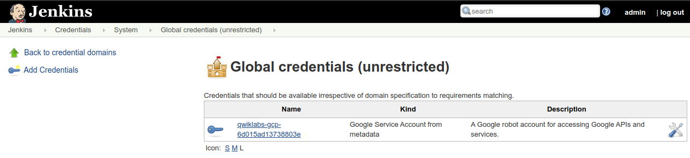

# Lab: Build a Continuous Deployment Pipeline with Jenkins and Kubernetes

For a more in depth best practices guide, go to the solution posted [here](https://cloud.google.com/solutions/jenkins-on-container-engine).

## Introduction
This guide will take you through the steps necessary to continuously deliver your software to end users by leveraging [Google Container Engine](https://cloud.google.com/container-engine/) and [Jenkins](https://jenkins.io) to orchestrate the software delivery pipeline.
If you are not familiar with basic Kubernetes concepts, have a look at [Kubernetes 101](http://kubernetes.io/docs/user-guide/walkthrough/).

In order to accomplish this goal you will use the following Jenkins plugins:
  - [Jenkins Kubernetes Plugin](https://wiki.jenkins-ci.org/display/JENKINS/Kubernetes+Plugin) - start Jenkins build executor containers in the Kubernetes cluster when builds are requested, terminate those containers when builds complete, freeing resources up for the rest of the cluster
  - [Jenkins Pipelines](https://jenkins.io/solutions/pipeline/) - define our build pipeline declaratively and keep it checked into source code management alongside our application code
  - [Google Oauth Plugin](https://wiki.jenkins-ci.org/display/JENKINS/Google+OAuth+Plugin) - allows you to add your google oauth credentials to jenkins

In order to deploy the application with [Kubernetes](http://kubernetes.io/) you will use the following resources:
  - [Deployments](http://kubernetes.io/docs/user-guide/deployments/) - replicates our application across our kubernetes nodes and allows us to do a controlled rolling update of our software across the fleet of application instances
  - [Services](http://kubernetes.io/docs/user-guide/services/) - load balancing and service discovery for our internal services
  - [Ingress](http://kubernetes.io/docs/user-guide/ingress/) - external load balancing and SSL termination for our external service
  - [Secrets](http://kubernetes.io/docs/user-guide/secrets/) - secure storage of non-public configuration information, SSL certs specifically in our case

## Prerequisites
1. A Google Cloud Platform Account
1. [Enable the Google Compute Engine and Google Container Engine APIs](https://console.cloud.google.com/flows/enableapi?apiid=compute_component,container)

## Do this first
In this section you will start your [Google Cloud Shell](https://cloud.google.com/cloud-shell/docs/) and clone the lab code repository to it.

1. Create a new Google Cloud Platform project: [https://console.developers.google.com/project](https://console.developers.google.com/project)

1. Click the Google Cloud Shell icon in the top-right and wait for your shell to open:

  

  

1. When the shell is open, set your default compute zone:

  ```shell
  $ gcloud config set compute/zone us-east1-d
  ```

1. Clone the lab repository in your cloud shell, then `cd` into that dir:

  ```shell
  $ git clone https://github.com/GoogleCloudPlatform/continuous-deployment-on-kubernetes.git
  Cloning into 'continuous-deployment-on-kubernetes'...
  ...

  $ cd continuous-deployment-on-kubernetes
  ```

## Create a Kubernetes Cluster
You'll use Google Container Engine to create and manage your Kubernetes cluster. Provision the cluster with `gcloud`:

```shell
$ gcloud container clusters create jenkins-cd \
  --num-nodes 3 \
  --scopes "https://www.googleapis.com/auth/projecthosting,storage-rw"
```

Once that operation completes download the credentials for your cluster using the [gcloud CLI](https://cloud.google.com/sdk/):
```shell
$ gcloud container clusters get-credentials jenkins-cd
Fetching cluster endpoint and auth data.
kubeconfig entry generated for jenkins-cd.
```

Confirm that the cluster is running and `kubectl` is working by listing pods:

```shell
$ kubectl get pods
```
You should see an empty response.

## Create namespace and quota for Jenkins

Create the `jenkins` namespace:
```shell
$ kubectl create ns jenkins
```

### Create the Jenkins Home Volume
In order to pre-populate Jenkins with the necessary [plugins and configuration](https://cloud.google.com/solutions/configuring-jenkins-container-engine) for the rest of the tutorial, you will create
a volume from an existing tarball of that data.

```shell
gcloud compute images create jenkins-home-image --source-uri https://storage.googleapis.com/solutions-public-assets/jenkins-cd/jenkins-home-v3.tar.gz
gcloud compute disks create jenkins-home --image jenkins-home-image
```


### Create a Jenkins Deployment and Service
Here you'll create a Deployment running a Jenkins container with a persistent disk attached containing the Jenkins home directory.

First, set the password for the default Jenkins user. Edit the password in `jenkins/k8s/options` with the password of your choice by replacing _CHANGE_ME_. To Generate a random password and replace it in the file, you can run:

```shell
$ PASSWORD=`openssl rand -base64 15`; echo "Your password is $PASSWORD"; sed -i.bak s#CHANGE_ME#$PASSWORD# jenkins/k8s/options
Your password is 2UyiEo2ezG/CKnUcgPxt
```

Now create the secret using `kubectl`:
```shell
$ kubectl create secret generic jenkins --from-file=jenkins/k8s/options --namespace=jenkins
secret "jenkins" created
```

Additionally you will have a service that will route requests to the controller.

> **Note**: All of the files that define the Kubernetes resources you will be creating for Jenkins are in the `jenkins/k8s` folder. You are encouraged to take a look at them before running the create commands.

The Jenkins Deployment is defined in `kubernetes/jenkins.yaml`. Create the Deployment and confirm the pod was scheduled:

```shell
$ kubectl apply -f jenkins/k8s/
deployment "jenkins" created
service "jenkins-ui" created
service "jenkins-discovery" created
```

Check that your master pod is in the running state

```shell
$ kubectl get pods --namespace jenkins
NAME                   READY     STATUS    RESTARTS   AGE
jenkins-master-to8xg   1/1       Running   0          30s
```

Now, check that the Jenkins Service was created properly:

```shell
$ kubectl get svc --namespace jenkins
NAME                CLUSTER-IP      EXTERNAL-IP   PORT(S)     AGE
jenkins-discovery   10.79.254.142   <none>        50000/TCP   10m
jenkins-ui          10.79.242.143   nodes         8080/TCP    10m
```

We are using the [Kubernetes Plugin](https://wiki.jenkins-ci.org/display/JENKINS/Kubernetes+Plugin) so that our builder nodes will be automatically launched as necessary when the Jenkins master requests them.
Upon completion of their work they will automatically be turned down and their resources added back to the clusters resource pool.

Notice that this service exposes ports `8080` and `50000` for any pods that match the `selector`. This will expose the Jenkins web UI and builder/agent registration ports within the Kubernetes cluster.
Additionally the `jenkins-ui` services is exposed using a NodePort so that our HTTP loadbalancer can reach it.

Kubernetes makes it simple to deploy an [Ingress resource](http://kubernetes.io/docs/user-guide/ingress/) to act as a public load balancer and SSL terminator.

The Ingress resource is defined in `jenkins/k8s/lb/ingress.yaml`. We used the Kubernetes `secrets` API to add our certs securely to our cluster and ready for the Ingress to use.

In order to create your own certs run:

```shell
$ openssl req -x509 -nodes -days 365 -newkey rsa:2048 -keyout /tmp/tls.key -out /tmp/tls.crt -subj "/CN=jenkins/O=jenkins"
```

Now you can upload them to Kubernetes as secrets:
```shell
$ kubectl create secret generic tls --from-file=/tmp/tls.crt --from-file=/tmp/tls.key --namespace jenkins
```

Now that the secrets have been uploaded, create the ingress load balancer. Note that the secrets must be created before the ingress, otherwise the HTTPs endpoint will not be created.

```shell
$ kubectl apply -f jenkins/k8s/lb
```

<a name="connect-to-jenkins"></a>
### Connect to Jenkins

Now find the load balancer IP address of your Ingress service (in the `Address` field). **This field may take a few minutes to appear as the load balancer is being provisioned**:

```shell
$  kubectl get ingress --namespace jenkins
NAME      RULE      BACKEND            ADDRESS         AGE
jenkins      -         master:8080        130.X.X.X      4m
```

The loadbalancer will begin health checks against your Jenkins instance. Once the checks go to healthy you will be able to access your Jenkins instance:
```shell
$  kubectl describe ingress jenkins --namespace jenkins
Name:			jenkins
Namespace:		jenkins
Address:		130.211.14.253
Default backend:	jenkins-ui:8080 (10.76.2.3:8080)
TLS:
  tls terminates
Rules:
  Host	Path	Backends
  ----	----	--------
Annotations:
  https-forwarding-rule:	k8s-fws-jenkins-jenkins
  https-target-proxy:		k8s-tps-jenkins-jenkins
  static-ip:			k8s-fw-jenkins-jenkins
  target-proxy:			k8s-tp-jenkins-jenkins
  url-map:			k8s-um-jenkins-jenkins
  backends:			{"k8s-be-32371":"HEALTHY"}   <---- LOOK FOR THIS TO BE HEALTHY
  forwarding-rule:		k8s-fw-jenkins-jenkins
Events:
  FirstSeen	LastSeen	Count	From				SubobjectPath	Type		Reason	Message
  ---------	--------	-----	----				-------------	--------	------	-------
  2m		2m		1	{loadbalancer-controller }			Normal		ADD	jenkins/jenkins
  1m		1m		1	{loadbalancer-controller }			Normal		CREATE	ip: 130.123.123.123 <--- This is the load balancer's IP
```

Open the load balancer's IP address in your web browser, click "Log in" in the top right and sign in with the default Jenkins username `jenkins` and the password you configured when deploying Jenkins. You can find the password in the `jenkins/k8s/options` file.

> **Note**: To further secure your instance follow the steps found [here](https://wiki.jenkins-ci.org/display/JENKINS/Securing+Jenkins).


### Your progress, and what's next
You've got a Kubernetes cluster managed by Google Container Engine. You've deployed:

* a Jenkins Deployment
* a (non-public) service that exposes Jenkins to its slave containers
* an Ingress resource that routes to the Jenkins service

You have the tools to build a continuous deployment pipeline. Now you need a sample app to deploy continuously.

## The sample app
You'll use a very simple sample application - `gceme` - as the basis for your CD pipeline. `gceme` is written in Go and is located in the `sample-app` directory in this repo. When you run the `gceme` binary on a GCE instance, it displays the instance's metadata in a pretty card:


The binary supports two modes of operation, designed to mimic a microservice. In backend mode, `gceme` will listen on a port (8080 by default) and return GCE instance metadata as JSON, with content-type=application/json. In frontend mode, `gceme` will query a backend `gceme` service and render that JSON in the UI you saw above. It looks roughly like this:

```
-----------      ------------      ~~~~~~~~~~~~        -----------
|         |      |          |      |          |        |         |
|  user   | ---> |   gceme  | ---> | lb/proxy | -----> |  gceme  |
|(browser)|      |(frontend)|      |(optional)|   |    |(backend)|
|         |      |          |      |          |   |    |         |
-----------      ------------      ~~~~~~~~~~~~   |    -----------
                                                  |    -----------
                                                  |    |         |
                                                  |--> |  gceme  |
                                                       |(backend)|
                                                       |         |
                                                       -----------
```
Both the frontend and backend modes of the application support two additional URLs:

1. `/version` prints the version of the binary (declared as a const in `main.go`)
1. `/healthz` reports the health of the application. In frontend mode, health will be OK if the backend is reachable.

### Deploy the sample app to Kubernetes
In this section you will deploy the `gceme` frontend and backend to Kubernetes using Kubernetes manifest files (included in this repo) that describe the environment that the `gceme` binary/Docker image will be deployed to. They use a default `gceme` Docker image that you will be updating with your own in a later section.

You'll have two primary environments - [canary](http://martinfowler.com/bliki/CanaryRelease.html) and production - and use Kubernetes to manage them.

> **Note**: The manifest files for this section of the tutorial are in `sample-app/k8s`. You are encouraged to open and read each one before creating it per the instructions.

1. First change directories to the sample-app:

  ```shell
  $ cd sample-app
  ```

1. Create the namespace for production:

  ```shell
  $ kubectl create ns production
  ```

1. Create the canary and production Deployments and Services:

    ```shell
    $ kubectl --namespace=production apply -f k8s/production
    $ kubectl --namespace=production apply -f k8s/canary
    $ kubectl --namespace=production apply -f k8s/services
    ```

1. Scale the production service:

    ```shell
    $ kubectl --namespace=production scale deployment gceme-frontend-production --replicas=4
    ```

1. Retrieve the External IP for the production services: **This field may take a few minutes to appear as the load balancer is being provisioned**:

  ```shell
  $ kubectl --namespace=production get service gceme-frontend
  NAME             CLUSTER-IP      EXTERNAL-IP      PORT(S)   AGE
  gceme-frontend   10.79.241.131   104.196.110.46   80/TCP    5h
  ```

1. Confirm that both services are working by opening the frontend external IP in your browser

1. Open a new Google Cloud Shell terminal by clicking the `+` button to the right of the current terminal's tab, and poll the production endpoint's `/version` URL. Leave this running in the second terminal so you can easily observe rolling updates in the next section:

   ```shell
   $ export FRONTEND_SERVICE_IP=$(kubectl get -o jsonpath="{.status.loadBalancer.ingress[0].ip}"  --namespace=production services gceme-frontend)
   $ while true; do curl http://$FRONTEND_SERVICE_IP/version; sleep 1;  done
   ```

1. Return to the first terminal

### Create a repository for the sample app source
Here you'll create your own copy of the `gceme` sample app in [Cloud Source Repository](https://cloud.google.com/source-repositories/docs/).

1. Go to Google Cloud Platform > Tools > Development and under repositories, create an empty repository called "default"

1. Change directories to `sample-app` of the repo you cloned previously, then initialize the git repository.

   **Be sure to replace _REPLACE_WITH_YOUR_PROJECT_ID_ with the name of your Google Cloud Platform project**

    ```shell
    $ cd sample-app
    $ git init
    $ git config credential.helper gcloud.sh
    $ git remote add origin https://source.developers.google.com/p/REPLACE_WITH_YOUR_PROJECT_ID/r/default
    ```

1. Ensure git is able to identify you:

    ```shell
    $ git config --global user.email "YOUR-EMAIL-ADDRESS"
    $ git config --global user.name "YOUR-NAME"
    ```

1. Add, commit, and push all the files:

    ```shell
    $ git add .
    $ git commit -m "Initial commit"
    $ git push origin master
    ```

## Create a pipeline
You'll now use Jenkins to define and run a pipeline that will test, build, and deploy your copy of `gceme` to your Kubernetes cluster. You'll approach this in phases. Let's get started with the first.

### Phase 1: Add your service account credentials
First we will need to configure our GCP credentials in order for Jenkins to be able to access our code repository

1. In the Jenkins UI, Click “Credentials” on the left
1. Click either of the “(global)” links (they both route to the same URL)
1. Click “Add Credentials” on the left
1. From the “Kind” dropdown, select “Google Service Account from metadata”
1. Click “OK”

You should now see 2 Global Credentials. Make a note of the name of second credentials as you will reference this in Phase 2:




### Phase 2: Create a job
This lab uses [Jenkins Pipeline](https://jenkins.io/solutions/pipeline/) to define builds as groovy scripts.

Navigate to your Jenkins UI and follow these steps to configure a Pipeline job (hot tip: you can find the IP address of your Jenkins install with `kubectl get ingress --namespace jenkins`):

1. Click the “Jenkins” link in the top left of the interface

1. Click the **New Item** link in the left nav

1. Name the project **sample-app**, choose the **Multibranch Pipeline** option, then click `OK`

1. Click `Add Source` and choose `git`

1. Paste the **HTTPS clone URL** of your `sample-app` repo on Cloud Source Repositories into the **Project Repository** field.
    It will look like: https://source.developers.google.com/p/REPLACE_WITH_YOUR_PROJECT_ID/r/default

1. From the Credentials dropdown select the name of new created credentials from the Phase 1.

1. Under "Build Triggers", check "Build Periodically" and enter "* * * * *" in to the "Schedule" field, this will ensure that Jenkins will check our repository for changes every minute.

1. Click `Save`, leaving all other options with their defaults

  

A job entitled "Branch indexing" was kicked off to see identify the branches in your repository. If you refresh Jenkins you should see the `master` branch now has a job created for it.

The first run of the job will fail until the project name is set properly in the next step.

### Phase 3:  Modify Jenkinsfile, then build and test the app

Create a branch for the canary environment called `canary`
   
   ```shell
    $ git checkout -b canary
   ```

The [`Jenkinsfile`](https://jenkins.io/doc/book/pipeline/jenkinsfile/) is written using the Jenkins Workflow DSL (Groovy-based). It allows an entire build pipeline to be expressed in a single script that lives alongside your source code and supports powerful features like parallelization, stages, and user input.

Modify your `Jenkinsfile` script so it contains the correct project name on line 2.

**Be sure to replace _REPLACE_WITH_YOUR_PROJECT_ID_ on line 2 with your project name:**

Don't commit the new `Jenkinsfile` just yet. You'll make one more change in the next section, then commit and push them together.

### Phase 4: Deploy a [canary release](http://martinfowler.com/bliki/CanaryRelease.html) to canary
Now that your pipeline is working, it's time to make a change to the `gceme` app and let your pipeline test, package, and deploy it.

The canary environment is rolled out as a percentage of the pods behind the production load balancer.
In this case we have 1 out of 5 of our frontends running the canary code and the other 4 running the production code. This allows you to ensure that the canary code is not negatively affecting users before rolling out to your full fleet.
You can use the [labels](http://kubernetes.io/docs/user-guide/labels/) `env: production` and `env: canary` in Google Cloud Monitoring in order to monitor the performance of each version individually.

1. In the `sample-app` repository on your workstation open `html.go` and replace the word `blue` with `orange` (there should be exactly two occurrences):

  ```html
  //snip
  <div class="card orange">
  <div class="card-content white-text">
  <div class="card-title">Backend that serviced this request</div>
  //snip
  ```

1. In the same repository, open `main.go` and change the version number from `1.0.0` to `2.0.0`:

   ```go
   //snip
   const version string = "2.0.0"
   //snip
   ```

1. `git add Jenkinsfile html.go main.go`, then `git commit -m "Version 2"`, and finally `git push origin canary` your change.

1. When your change has been pushed to the Git repository, navigate to Jenkins. Your build should start shortly.

  

1. Once the build is running, click the down arrow next to the build in the left column and choose **Console Output**:

  

1. Track the output for a few minutes and watch for the `kubectl --namespace=production apply...` to begin. When it starts, open the terminal that's polling canary's `/version` URL and observe it start to change in some of the requests:

   ```
  1.0.0
  1.0.0
  1.0.0
  1.0.0
  2.0.0
  2.0.0
  1.0.0
  1.0.0
  1.0.0
  1.0.0
   ```

   You have now rolled out that change to a subset of users.

1. Once the change is deployed to canary, you can continue to roll it out to the rest of your users by creating a branch called `production` and pushing it to the Git server:

   ```shell
    $ git checkout master
    $ git merge canary
    $ git push origin master
   ```
1. In a minute or so you should see that the master job in the sample-app folder has been kicked off:

    

1. Clicking on the `master` link will show you the stages of your pipeline as well as pass/fail and timing characteristics.

    

1. Open the terminal that's polling canary's `/version` URL and observe that the new version (2.0.0) has been rolled out and is serving all requests.

   ```
   2.0.0
   2.0.0
   2.0.0
   2.0.0
   2.0.0
   2.0.0
   2.0.0
   2.0.0
   2.0.0
   2.0.0
   ```

1. Look at the `Jenkinsfile` in the project to see how the workflow is written.

### Phase 5: Deploy a development branch
Often times changes will not be so trivial that they can be pushed directly to the canary environment. In order to create a development environment from a long lived feature branch
all you need to do is push it up to the Git server and let Jenkins deploy your environment. In this case you will not use a loadbalancer so you'll have to access your application using `kubectl proxy`,
which authenticates itself with the Kuberentes API and proxies requests from your local machine to the service in the cluster without exposing your service to the internet.

#### Deploy the development branch

1. Create another branch and push it up to the Git server

   ```shell
   $ git checkout -b new-feature
   $ git push origin new-feature
   ```

1. Open Jenkins in your web browser and navigate to the sample-app job. You should see that a new job called "new-feature" has been created and your environment is being created.

1. Navigate to the console output of the first build of this new job by:

  * Click the `new-feature` link in the job list.
  * Click the `#1` link in the Build History list on the left of the page.
  * Finally click the `Console Output` link in the left navigation.

1. Scroll to the bottom of the console output of the job, and you will see instructions for accessing your environment:

   ```
   deployment "gceme-frontend-dev" created
   [Pipeline] echo
   To access your environment run `kubectl proxy`
   [Pipeline] echo
   Then access your service via http://localhost:8001/api/v1/proxy/namespaces/new-feature/services/gceme-frontend:80/
   [Pipeline] }
   ```

#### Access the development branch

1. Open a new Google Cloud Shell terminal by clicking the `+` button to the right of the current terminal's tab, and start the proxy:

   ```shell
   $ kubectl proxy
   ```

1. Return to the original shell, and access your application via localhost:

   ```shell
   $ curl http://localhost:8001/api/v1/proxy/namespaces/new-feature/services/gceme-frontend:80/
   ```

1. You can now push code to the `new-feature` branch in order to update your development environment.

1. Once you are done, merge your `new-feature ` branch back into the  `canary` branch to deploy that code to the canary environment:

   ```shell
   $ git checkout canary
   $ git merge new-feature
   $ git push origin canary
   ```

1. When you are confident that your code won't wreak havoc in production, merge from the `canary` branch to the `master` branch. Your code will be automatically rolled out in the production environment:

   ```shell
   $ git checkout master
   $ git merge canary
   $ git push origin master
   ```

1. When you are done with your development branch, delete it from the server and delete the environment in Kubernetes:

   ```shell
   $ git push origin :new-feature
   $ kubectl delete ns new-feature
   ```

## Extra credit: deploy a breaking change, then roll back
Make a breaking change to the `gceme` source, push it, and deploy it through the pipeline to production. Then pretend latency spiked after the deployment and you want to roll back. Do it! Faster!

Things to consider:

* What is the Docker image you want to deploy for roll back?
* How can you interact directly with the Kubernetes to trigger the deployment?
* Is SRE really what you want to do with your life?

## Clean up
Clean up is really easy, but also super important: if you don't follow these instructions, you will continue to be billed for the Google Container Engine cluster you created.

To clean up, navigate to the [Google Developers Console Project List](https://console.developers.google.com/project), choose the project you created for this lab, and delete it. That's it.

